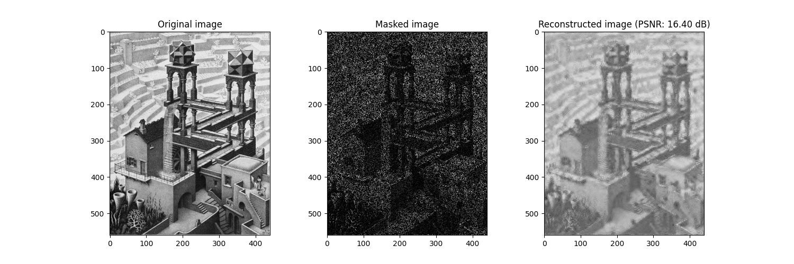
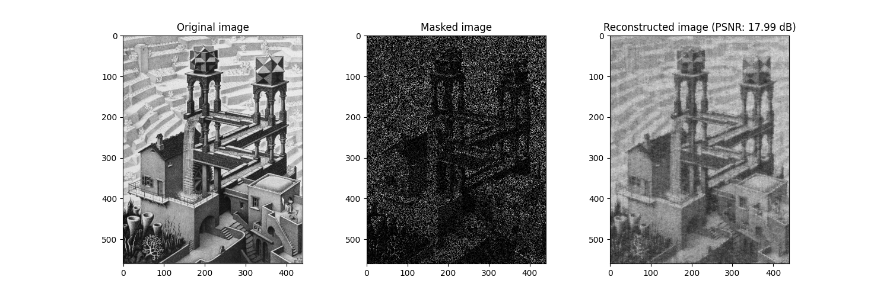

# 2D Compressed Sensing in JAX

## Description

A simple implementation of 2D compressed sensing using JAX.
This implementation partially reproduces the tutorial from [Robert Taylor](https://humaticlabs.com/blog/compressed-sensing-python/), but relies entirely on ```jax``` and ```jaxopt``` rather than external libraries for computation of the gradients and the optimization.
The implementation of the wavelets is taken from [jax-wavelets](https://github.com/crowsonkb/jax-wavelets).

## Explanation

Given a sparse sensing operator $$\Phi$$, we find a sparse representation $$\theta$$ of the image $$x$$ transformed by a universal transform basis $$\Psi$$, i.e. $$x = \Psi(\theta)$$.
Finding the optimal $$\theta^{\star}$$ is equivalent to solving the LASSO regression with a regularization weight $$\lambda$$:

$$\theta^\star = \arg \min_{\theta} || \Phi(\Psi(\theta)) - \Phi(x)||_2^2 + \lambda ||\theta||_1$$  

We solve this problem using the implementation of the [FISTA](https://epubs.siam.org/doi/10.1137/080716542) algorithm in ```jaxopt```.

## Requirements

The following packages are required:

```
jax==0.8.0
jaxopt==0.8.5
PyWavelets==1.9.0
```

## Examples

Example using Daubechies wavelet (6) with 25% of samples. 



Example using Discrete Cosine Transform with 25% of samples. 


